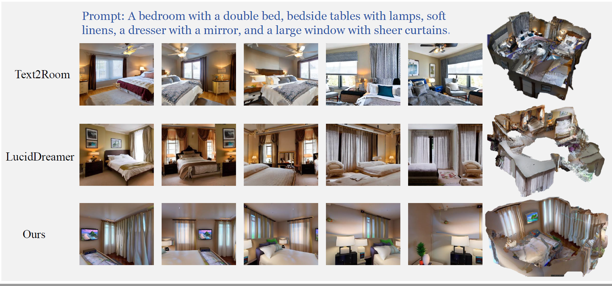
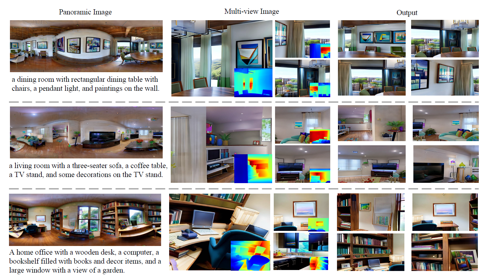

# SceneDreamer360: Text-Driven 3D-Consistent Scene Generation with Panoramic Gaussian Splatting

[**Wenrui Li**](https://liwrui.github.io/),
[**Yapeng Mi**](https://github.com/miyapeng),
[**Fucheng Cai**](https://github.com/HITCai),
[**Zhe Yang**](https://github.com/xia-zhe),
[**Wangmeng Zuo**](https://scholar.google.com/citations?user=rUOpCEYAAAAJ),
[**Xingtao Wang**](https://homepage.hit.edu.cn/xtwang),
[**Xiaopeng Fan**](https://scholar.google.cz/citations?hl=zh-CN&user=4LsZhDgAAAAJ&view_op=list_works&sortby=pubdate)

[\[🌐 Project Page\]](https://scenedreamer360.github.io/) [\[📜 Paper\]](https://arxiv.org/abs/2408.13711)

## Introduction
SceneDreamer360 leverages a text-driven panoramic image generation model as a prior for 3D scene generation and employs 3D Gaussian Splatting (3DGS) to ensure consistency across multi-view panoramic images. Specifically, SceneDreamer360 enhances the fine-tuned Panfusion generator with a three-stage panoramic enhancement, enabling the generation of high-resolution, detail-rich panoramic images. During the 3D scene construction, a novel point cloud fusion initialization method is used, producing higher quality and spatially consistent point clouds. Our extensive experiments demonstrate that compared to other methods, SceneDreamer360 with its panoramic image generation and 3DGS can produce higher quality, spatially consistent, and visually appealing 3D scenes from any text prompt.

## Visualization

## Codes
Coming Soon in later septemper 2024!

